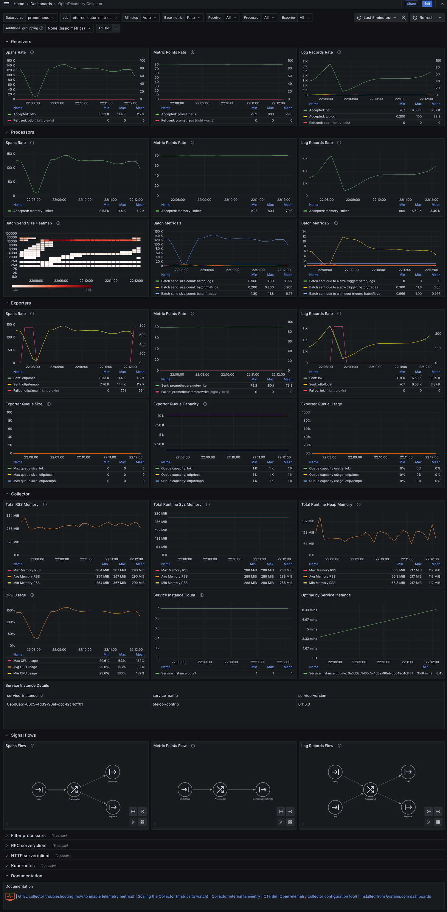

# OpenTelemetry (OTEL) collector monitoring

## Metrics

Collector can expose Prometheus metrics locally on port 8888 and path 
`/metrics`. For containerized environments it may be desirable to expose this 
port on a public interface instead of just locally.

```
service:
  telemetry:
    metrics:
      address: 127.0.0.1:8888
      level: detailed   
```

Collector can scrape own metric via own metric pipeline, so real configuration 
can looks like:
```
extensions:
  sigv4auth/aws:

receivers:
  prometheus:
    config:
      scrape_configs:
      - job_name: otel-collector-metrics
        scrape_interval: 10s
        static_configs:
          - targets: ['127.0.0.1:8888']

exporters:
  prometheusremotewrite/aws:
    endpoint: ${PROMETHEUS_ENDPOINT}
    auth:
      authenticator: sigv4auth/aws
    retry_on_failure:
      enabled: true
      initial_interval: 1s
      max_interval: 10s
      max_elapsed_time: 30s

service:
  pipelines:
    metrics:
      receivers: [prometheus]
      processors: []
      exporters: [awsprometheusremotewrite]
  telemetry:
    metrics:
      address: 127.0.0.1:8888
      level: detailed
```

## Grafana dashboard for OpenTelemetry collector metrics

[](https://github.com/monitoringartist/opentelemetry-collector-monitoring/tree/main/dashboard)

## Prometheus alerts

Recommended Prometheus alerts for OpenTelemetry collector metrics:
```
groups:
  - name: opentelemetry-collector
    rules:
      - alert: processor-dropped-spans
        expr: sum(rate(otelcol_processor_dropped_spans{}[1m])) > 0
        for: 5m
        labels:
          severity: critical
        annotations:
          summary: Some spans have been dropped by processor
          description: Maybe collector has received non standard spans or it reached some limits
      - alert: processor-dropped-metrics
        expr: sum(rate(otelcol_processor_dropped_metric_points{}[1m])) > 0
        for: 5m
        labels:
          severity: critical
        annotations:
          summary: Some metric points have been dropped by processor
          description: Maybe collector has received non standard metric points or it reached some limits
    - alert: receiver-refused-spans
      expr: sum(rate(otelcol_receiver_refused_spans{}[1m])) > 0
      for: 5m
      labels:
        severity: critical
      annotations:
        summary: Some spans have been refused by receiver
        description: Maybe collector has received non standard spans or it reached some limits
    - alert: receiver-refused-metrics
      expr: sum(rate(otelcol_receiver_refused_metric_points{}[1m])) > 0
      for: 5m
      labels:
        severity: critical
      annotations:
        summary: Some metric points have been refused by receiver
        description: Maybe collector has received non standard metric points or it reached some limits
    - alert: exporter-enqueued-spans
      expr: sum(rate(otelcol_exporter_enqueue_failed_spans{}[1m])) > 0
      for: 5m
      labels:
        severity: critical
      annotations:
        summary: Some spans have been enqueued by exporter
        description: Maybe used destination has a problem or used payload is not correct
    - alert: exporter-enqueued-metrics
      expr: sum(rate(otelcol_exporter_enqueue_failed_metric_points{}[1m])) > 0
      for: 5m
      labels:
        severity: critical
      annotations:
        summary: Some metric points have been enqueued by exporter
        description: Maybe used destination has a problem or used payload is not correct
    - alert: exporter-failed-requests
      expr: sum(rate(otelcol_exporter_send_failed_requests{}[1m])) > 0
      for: 5m
      labels:
        severity: critical
      annotations:
        summary: Some exporter requests failed
        description: Maybe used destination has a problem or used payload is not correct
    - alert: high-cpu-usage
      expr: max(rate(otelcol_process_cpu_seconds{}[1m])*100) > 90
      for: 5m
      labels:
        severity: critical
      annotations:
        summary: High max CPU usage
        description: Collector need to scale up
```

## Documentation

- https://github.com/open-telemetry/opentelemetry-collector/blob/main/docs/monitoring.md
- https://github.com/open-telemetry/opentelemetry-collector/blob/main/docs/troubleshooting.md#metrics
